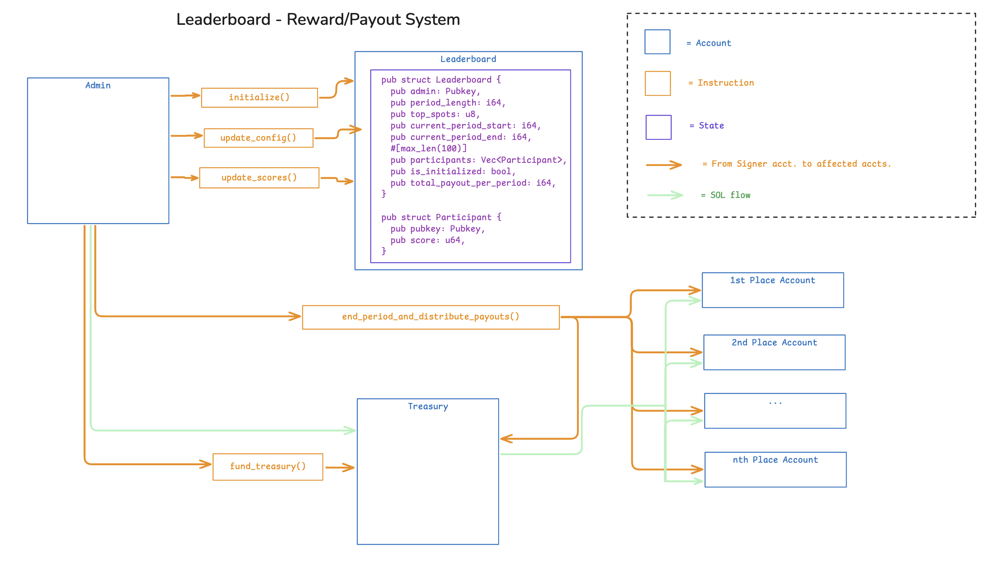
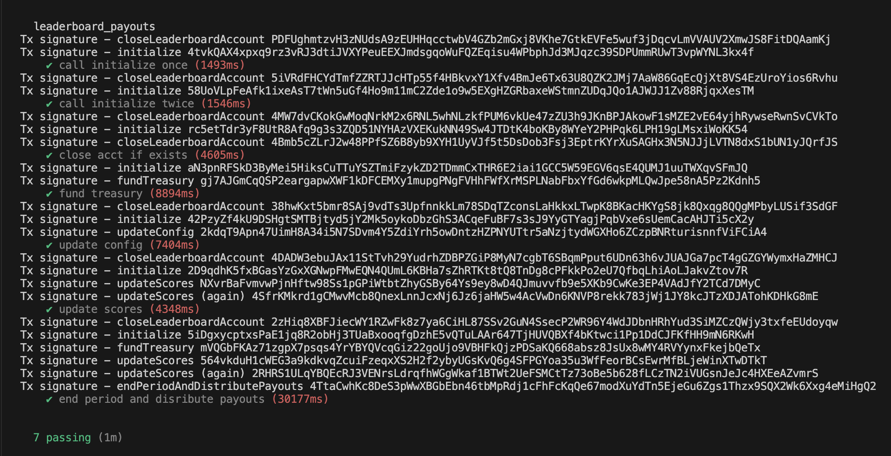

<h2>leaderboard_payouts</h2>

**Devnet Program ID: gq62AM2KnQhcbWrbu1MLvf7PpkeChefZG8UV85nQ5kc**

An on-chain, implementation-agnostic system of storing top participants in a competition (game, contest, most art / video views), and dispensing payouts to the top slots at the end of every period/cycle.  At initialization, the admin account defines the period length, number of top spots, and total payout per period.  For this MVP version, I'm using a single algorithm for payouts, and would like to expand to include multiple options.

